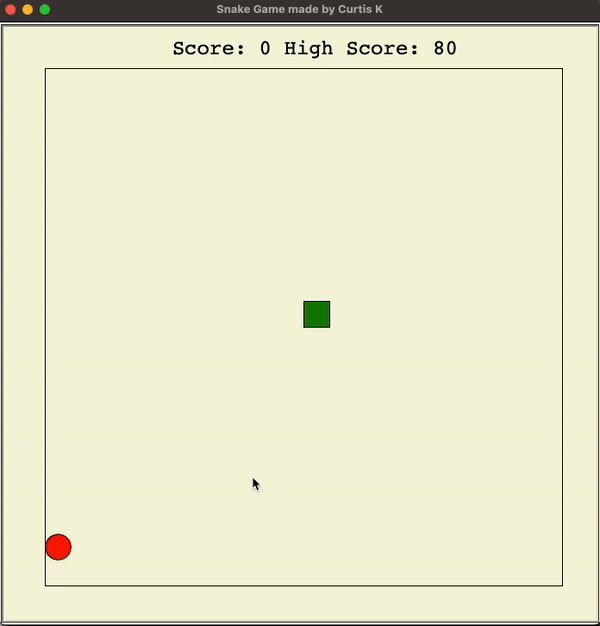

# Snake-Game
This is my implementation of the popular Snake game using Python module Turtle

## How to Play

Use arrow keys to move around. Collect food and grow your snake. Press <b>R</b> to restart once you die.
